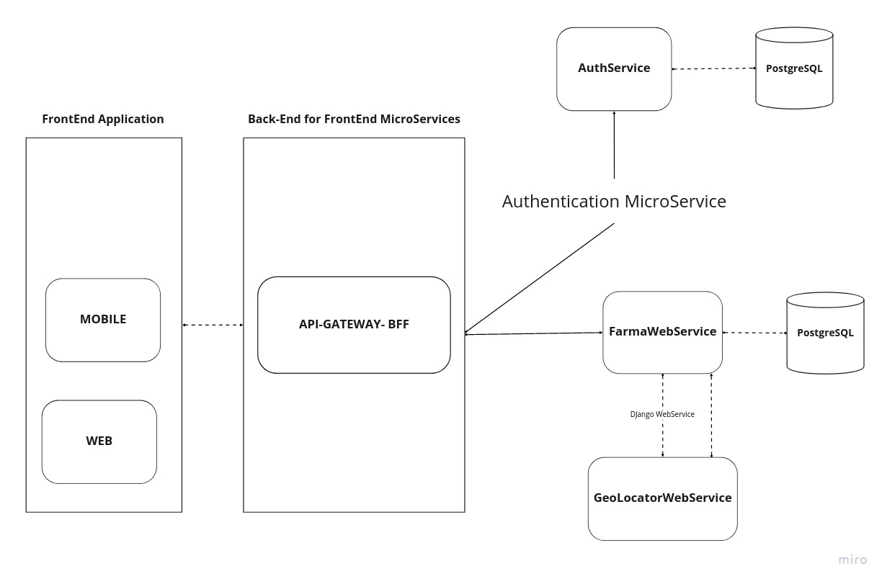
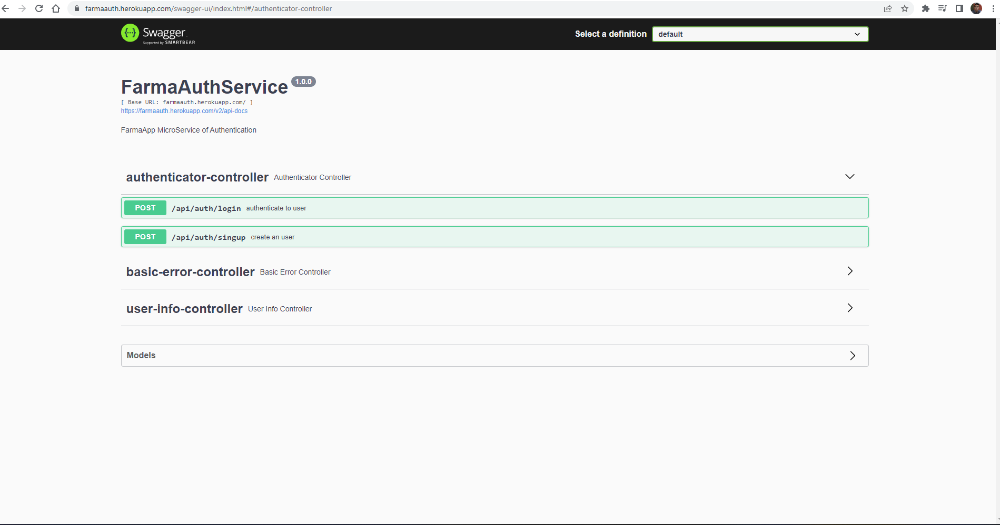
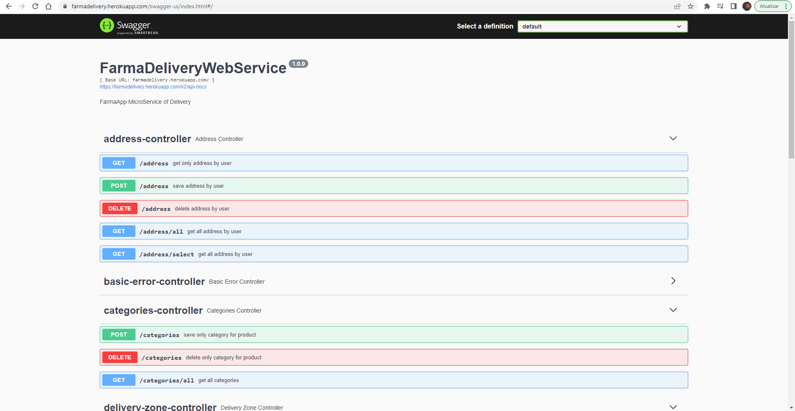
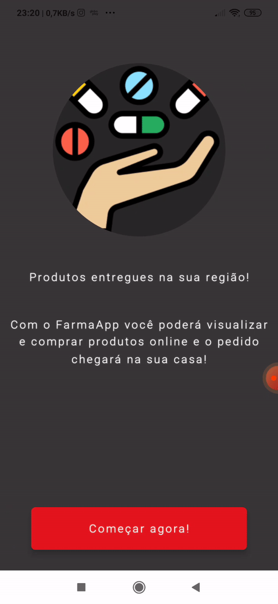

# FarmaApp

É um app desenvolvido em ambiente academico que tem como objetivo facilitar a compra e venda de produtos farmaceuticos de maneira que os clientes consultam os medicamentos cadastrados no sistema e com base na sua localização/endereço de entrega é apresentado os produtos das farmacias na qual atende a necessidade do cliente.

Tecnologiase ferramentas utilizadas para implementação da primeira versão do app.
  - JetPackCompose (beta).
  - Koin.
  - Retrofit.
  - Glide.
  - RoomDatabase.
  - Firebase.
  - Coroutines.
  
  
Tecnologias e ferramentas utilizadas para implementação dos microserviços no qual o app consome.
  - Java/Kotlin.
  - Spring Boot.
  - Spring Security.
  - PostgreSQL.
  - Python.
  - Django.
  - PostGIS.
  - Heroku.

### Desenho Macro da aplicação

### Swaggers

### GIFS

